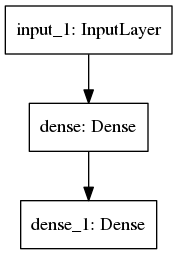
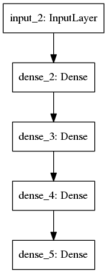
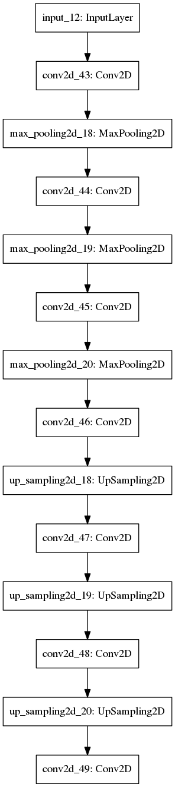
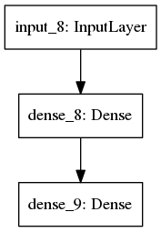
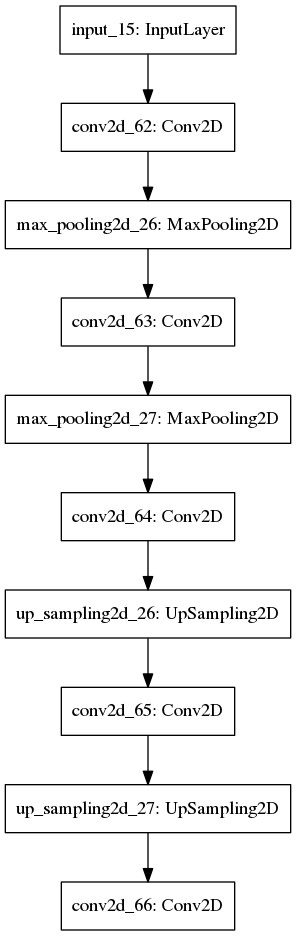

# Autoencoders
Autoencoders are a class of Unsupervised Networks that consist of two major networks: Encoders and Decoders.
There are following types of various Autoencoders:

Vanilla_Autoencoder

Multilayer_Autoencoder

Vanilla_Autoencoder

Vanilla_Autoencoder

Vanilla_Autoencoder
